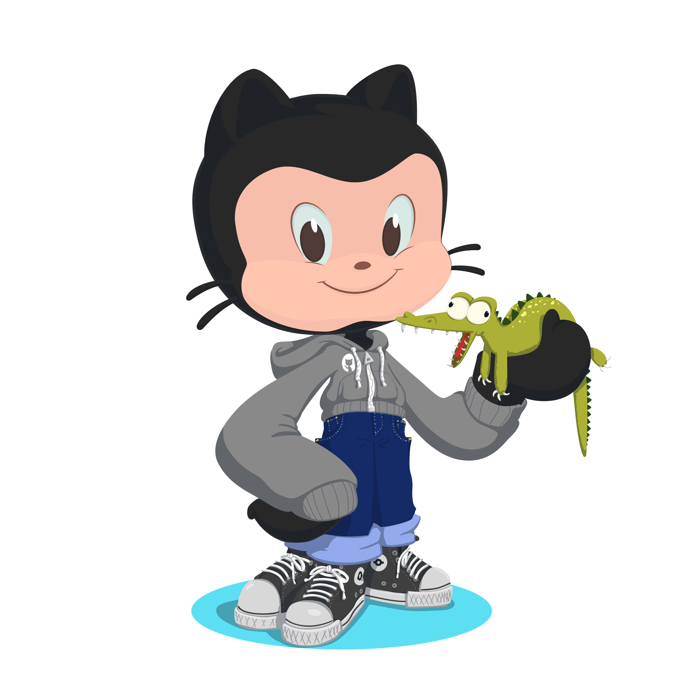

# Bienvenido a mi perfil, yo soy Jaime 🤟

Soy Técnico de redes en la empresa Chequemotiva 🧑‍💻 y estudiante de Desarrollo de Aplicaciones Web en el Instituto IES Luis Vives 📓

---

### Aficiones y hobbies 🔝
En mi tiempo libre me gusta salir con mis amigos y mi pareja 👫, jugar al padel 🎾, programar 💻, ver películas y series 🎥 y jugar a videojuegos 🎮

---

### Un poco sobre mí 🙋‍♂️
Soy trabajador y proactivo, siempre trato de aprender cosas nuevas y mejorar 💪🏼

---

### Tecnologías 💻

  
  
  
  
  
  
  
  
   
  
  
  
  
  
  
  

---

